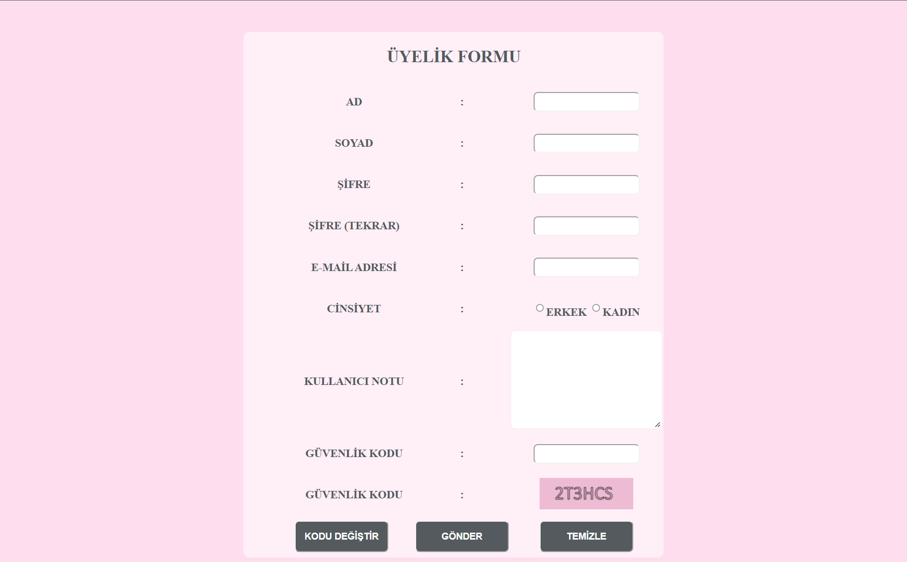

# ÜYELİK FORMU UYGULAMASI

---

- Kullanıcı adı ve soyadı boş geçildiğinde uyarı veriyor.
- Şİfre uzunluğu 6-25 arasında değilse ve şifre tekrarı ile uyuşmuyorsa uyarı veriyor.
- E-mail adresi boş geçildiğinde ve uygun girilmediğinde (@ ve . bulunmalı) uyarı veriyor.
- Cinsiyet seçilmediğinde uyarı veriyor.
- Kullanıcı notu boş geçildiğinde uyarı veriyor.
- Güvenlik kodu boş geçildiğinde ve yanlış girildiğinde uyarı veriyor.

---

